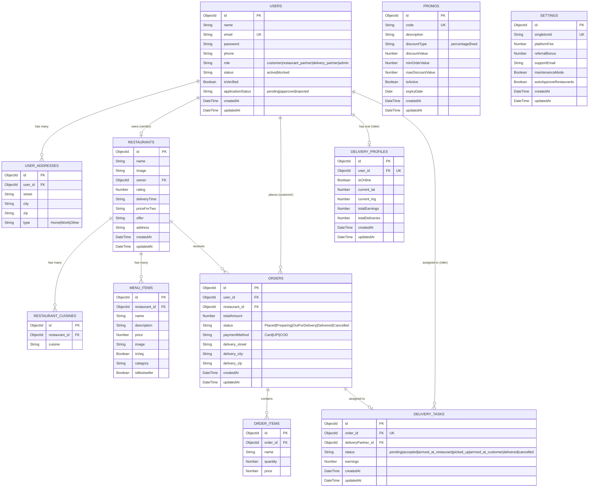
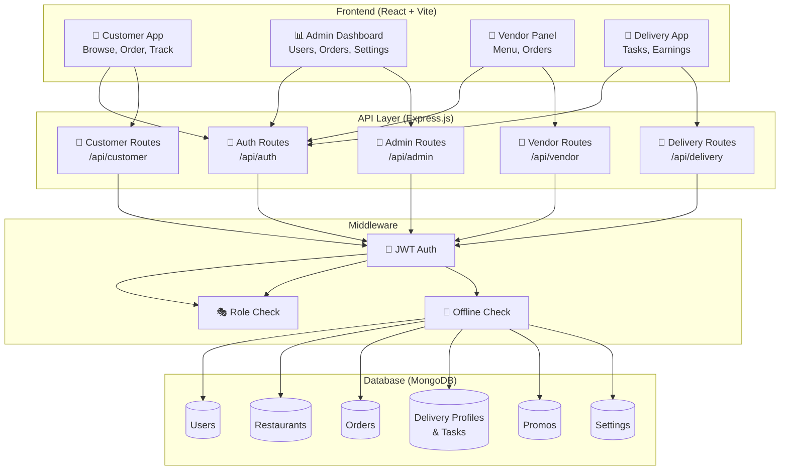
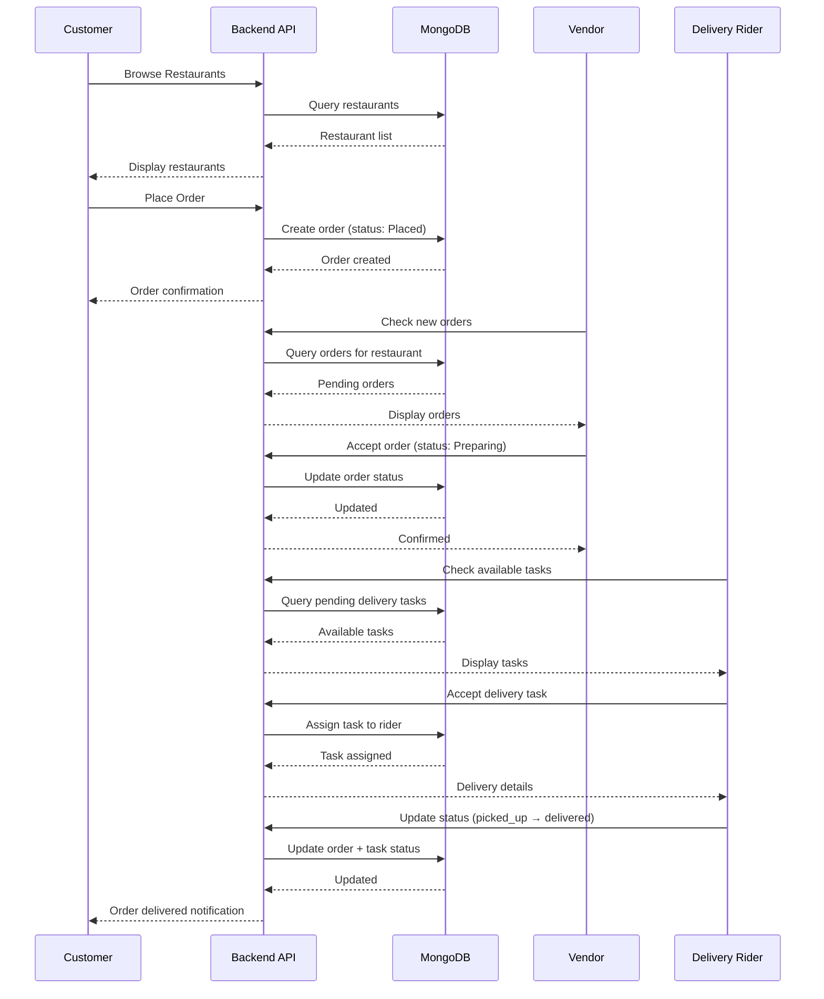

# Cravify — Entity Relationship Diagram

## ER Diagram (Mermaid)

```mermaid
erDiagram
    USERS {
        ObjectId id PK
        String name
        String email UK
        String password
        String phone
        String role "customer|restaurant_partner|delivery_partner|admin"
        String status "active|blocked"
        Boolean isVerified
        String applicationStatus "pending|approved|rejected"
        DateTime createdAt
        DateTime updatedAt
    }

    USER_ADDRESSES {
        ObjectId id PK
        ObjectId user_id FK
        String street
        String city
        String zip
        String type "Home|Work|Other"
    }

    RESTAURANTS {
        ObjectId id PK
        String name
        String image
        ObjectId owner FK
        Number rating
        String deliveryTime
        String priceForTwo
        String offer
        String address
        DateTime createdAt
        DateTime updatedAt
    }

    RESTAURANT_CUISINES {
        ObjectId id PK
        ObjectId restaurant_id FK
        String cuisine
    }

    MENU_ITEMS {
        ObjectId id PK
        ObjectId restaurant_id FK
        String name
        String description
        Number price
        String image
        Boolean isVeg
        String category
        Boolean isBestseller
    }

    ORDERS {
        ObjectId id PK
        ObjectId user_id FK
        ObjectId restaurant_id FK
        Number totalAmount
        String status "Placed|Preparing|OutForDelivery|Delivered|Cancelled"
        String paymentMethod "Card|UPI|COD"
        String delivery_street
        String delivery_city
        String delivery_zip
        DateTime createdAt
        DateTime updatedAt
    }

    ORDER_ITEMS {
        ObjectId id PK
        ObjectId order_id FK
        String name
        Number quantity
        Number price
    }

    DELIVERY_PROFILES {
        ObjectId id PK
        ObjectId user_id FK "UK"
        Boolean isOnline
        Number current_lat
        Number current_lng
        Number totalEarnings
        Number totalDeliveries
        DateTime createdAt
        DateTime updatedAt
    }

    DELIVERY_TASKS {
        ObjectId id PK
        ObjectId order_id FK "UK"
        ObjectId deliveryPartner_id FK
        String status "pending|accepted|arrived_at_restaurant|picked_up|arrived_at_customer|delivered|cancelled"
        Number earnings
        DateTime createdAt
        DateTime updatedAt
    }

    PROMOS {
        ObjectId id PK
        String code UK
        String description
        String discountType "percentage|fixed"
        Number discountValue
        Number minOrderValue
        Number maxDiscountValue
        Boolean isActive
        Date expiryDate
        DateTime createdAt
        DateTime updatedAt
    }

    SETTINGS {
        ObjectId id PK
        String singletonId UK
        Number platformFee
        Number referralBonus
        String supportEmail
        Boolean maintenanceMode
        Boolean autoApproveRestaurants
        DateTime createdAt
        DateTime updatedAt
    }

    %% Relationships
    USERS ||--o{ USER_ADDRESSES : "has many"
    USERS ||--o| RESTAURANTS : "owns (vendor)"
    USERS ||--o{ ORDERS : "places (customer)"
    USERS ||--o| DELIVERY_PROFILES : "has one (rider)"
    USERS ||--o{ DELIVERY_TASKS : "assigned to (rider)"

    RESTAURANTS ||--o{ RESTAURANT_CUISINES : "has many"
    RESTAURANTS ||--o{ MENU_ITEMS : "has many"
    RESTAURANTS ||--o{ ORDERS : "receives"

    ORDERS ||--o{ ORDER_ITEMS : "contains"
    ORDERS ||--o| DELIVERY_TASKS : "assigned to"
```

## Architecture Diagram

```mermaid
graph TB
    subgraph "Frontend (React + Vite)"
        FE_CUSTOMER["🍕 Customer App<br/>Browse, Order, Track"]
        FE_ADMIN["📊 Admin Dashboard<br/>Users, Orders, Settings"]
        FE_VENDOR["🏪 Vendor Panel<br/>Menu, Orders"]
        FE_DELIVERY["🛵 Delivery App<br/>Tasks, Earnings"]
    end

    subgraph "API Layer (Express.js)"
        AUTH["🔐 Auth Routes<br/>/api/auth"]
        CUSTOMER_API["👤 Customer Routes<br/>/api/customer"]
        ADMIN_API["👑 Admin Routes<br/>/api/admin"]
        VENDOR_API["🏪 Vendor Routes<br/>/api/vendor"]
        DELIVERY_API["🛵 Delivery Routes<br/>/api/delivery"]
    end

    subgraph "Middleware"
        JWT["🔑 JWT Auth"]
        ROLE["🎭 Role Check"]
        OFFLINE["📡 Offline Check"]
    end

    subgraph "Database (MongoDB)"
        USERS_DB[("Users")]
        RESTAURANTS_DB[("Restaurants")]
        ORDERS_DB[("Orders")]
        DELIVERY_DB[("Delivery Profiles<br/>& Tasks")]
        PROMOS_DB[("Promos")]
        SETTINGS_DB[("Settings")]
    end

    FE_CUSTOMER --> AUTH
    FE_CUSTOMER --> CUSTOMER_API
    FE_ADMIN --> AUTH
    FE_ADMIN --> ADMIN_API
    FE_VENDOR --> AUTH
    FE_VENDOR --> VENDOR_API
    FE_DELIVERY --> AUTH
    FE_DELIVERY --> DELIVERY_API

    AUTH --> JWT
    CUSTOMER_API --> JWT
    ADMIN_API --> JWT --> ROLE
    VENDOR_API --> JWT --> ROLE
    DELIVERY_API --> JWT

    JWT --> OFFLINE
    OFFLINE --> USERS_DB
    OFFLINE --> RESTAURANTS_DB
    OFFLINE --> ORDERS_DB
    OFFLINE --> DELIVERY_DB
    OFFLINE --> PROMOS_DB
    OFFLINE --> SETTINGS_DB
```

## Order Flow Diagram

```mermaid
sequenceDiagram
    participant C as Customer
    participant API as Backend API
    participant DB as MongoDB
    participant V as Vendor
    participant R as Delivery Rider

    C->>API: Browse Restaurants
    API->>DB: Query restaurants
    DB-->>API: Restaurant list
    API-->>C: Display restaurants

    C->>API: Place Order
    API->>DB: Create order (status: Placed)
    DB-->>API: Order created
    API-->>C: Order confirmation

    V->>API: Check new orders
    API->>DB: Query orders for restaurant
    DB-->>API: Pending orders
    API-->>V: Display orders

    V->>API: Accept order (status: Preparing)
    API->>DB: Update order status
    DB-->>API: Updated
    API-->>V: Confirmed

    R->>API: Check available tasks
    API->>DB: Query pending delivery tasks
    DB-->>API: Available tasks
    API-->>R: Display tasks

    R->>API: Accept delivery task
    API->>DB: Assign task to rider
    DB-->>API: Task assigned
    API-->>R: Delivery details

    R->>API: Update status (picked_up → delivered)
    API->>DB: Update order + task status
    DB-->>API: Updated
    API-->>C: Order delivered notification
```
